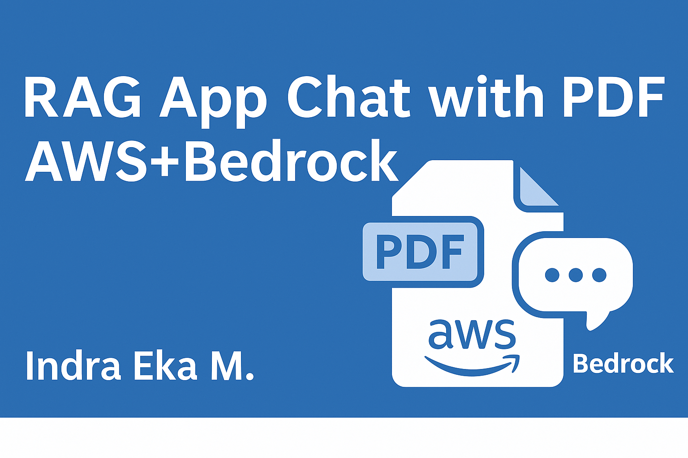

# 🧠 RAG_AppChatWithPDF_AWSbedrock



A Retrieval-Augmented Generation (RAG) application that enables interactive **PDF-based Q&A** using **AWS Bedrock** models (Claude & Llama3) via **Streamlit**.  
This project leverages **Indo/Amazon Titan Embeddings**, **FAISS vector store**, and **LangChain** to allow users to chat with uploaded PDF documents.

---


---

## 🚀 Features

- Upload up to 5 PDF documents
- Text chunking with overlap using `RecursiveCharacterTextSplitter`
- Embedding generation with `Titan Embeddings`
- Semantic vector search using **FAISS**
- Answer generation using **Claude v2** or **Llama3 (70B)** on AWS Bedrock
- Friendly Streamlit UI with sidebar controls

---

## 🧱 Tech Stack

- **Backend**: LangChain, FAISS, AWS Bedrock
- **Frontend**: Streamlit
- **Embedding Model**: amazon.titan-embed-text-v1
- **LLM**: Claude v2, meta.llama3-70b-instruct-v1:0


---

## ⚙️ Setup & Run

```bash
# Install dependencies
pip install -r requirements.txt

# Run the Streamlit app
streamlit run app.py
```

Make sure your AWS credentials are configured and Bedrock is enabled.

---

## 📌 Notes

- You can upload max 5 PDFs to `data/` folder.
- Make sure to update the FAISS index when uploading new files.
- Embeddings and LLM calls are powered by AWS Bedrock.

---

## 👨‍💻 Author

**Indra Eka Mandriana S.Kom**  
_RAG & LLM App Developer | AI in Document Processing_

---

## ⭐ Like this project? Star it on GitHub and share it!
